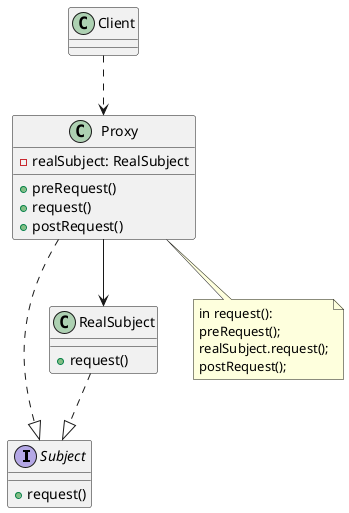

# 代理模式

最新更新：`= dateformat(date(today), "yyyy-MM-dd")`

---

## 核心内容

- 客户端可能无法或不宜直接访问目标对象（如远程资源、资源消耗大的对象）
- 引入一个代理角色，隐藏直接访问的复杂性，提供额外服务（权限检查、缓存、延迟加载）
- 避免直接暴露真实对象，符合[[开闭原则]]，系统耦合度降低
## 正文

- Subject：抽象主题角色，定义真实主题与代理角色的公共接口，使得客户端能一致性地对待真实主题与代理角色
- RealSubject：
	- 真实主题角色，实现Subject接口，提供真实的业务逻辑
	- 客户端不直接访问，通过代理间接调用
- Proxy：
	- 代理主题角色，实现Subject接口，持有真实主题角色引用
	- 不只有转发调用，还可以添加预处理、后处理和控制创建/删除真实对象等

[[代理模式-2025-11-24-01-14-43.svg]]

## 模式优点

## 模式缺点

## 模式扩展

## 实际代码/示例

[[代理模式代码]]

## 相关链接
[[软件设计模式]]
[[结构型模式]]

