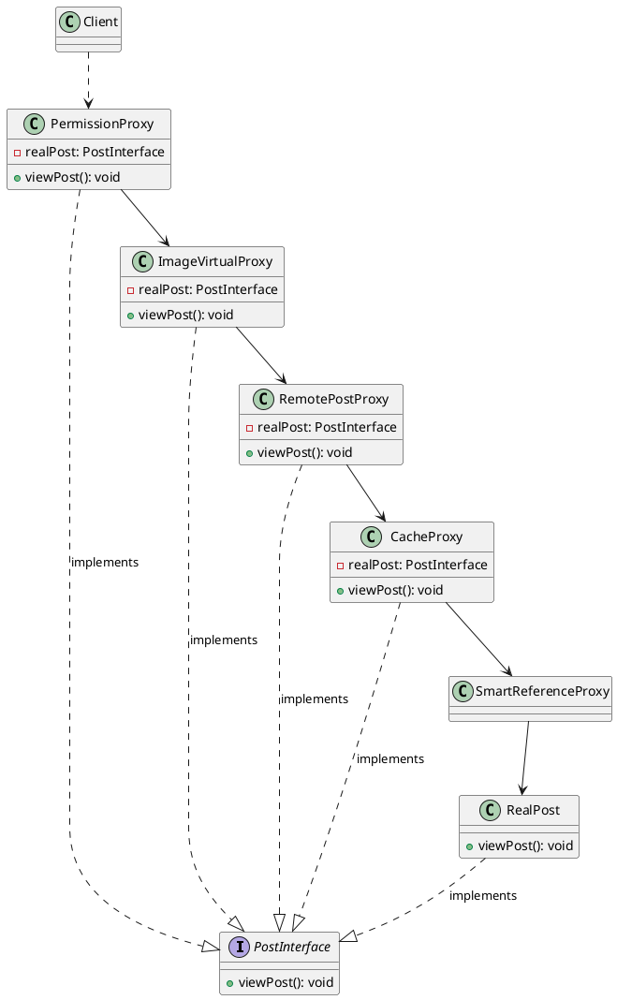

# 代理模式代码

最新更新：`= dateformat(date(today), "yyyy-MM-dd")`

**语言**：Java

**一句话描述**：

```java
public class App {
	public static void main(String[] args) {
	}
}
```


[[代理模式代码-2025-11-24-01-23-58.svg]]


## References
[[代理模式]]