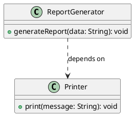

# 依赖（dependency)关系

最新更新：`= dateformat(date(today), "yyyy-MM-dd")`

---

## 核心内容

类A使用一个类B，但是这种使用是==短暂的、临时==的，类A==并不持有==类B的长期引用（成员变量）


## 正文

- 类B实例通常只出现在类A的方法内部，例如方法中的参数，局部变量、返回值，或者通过静态方法调用
- 类A没有类B作为成员变量（属性），即不持有类B的引用。因此类A的生命周期并不影响类B
- 可以是单向依赖，[[双向依赖]]，[[自身依赖]]
- 在UML图中，用虚线箭头表示（依赖方 类A --> 被依赖方 类B）


## 相关链接
[[软件设计模式]]
[[UML]]
[[关联（Association）关系]]


## 实际代码/示例

此样例是单向依赖

```java
class Printer {  // 类B：被依赖的类
    public void print(String message) {
        System.out.println(message);
    }
}

class ReportGenerator {  // 类A：依赖方
    public void generateReport(String data) {
        Printer printer = new Printer();  // 局部变量：临时创建类B实例
        printer.print(data);  // 使用类B，但不持有长期引用
    }
}
```

[[依赖（dependency)关系-2025-11-20-02-35-22.svg]]



