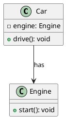

# 关联（Association）关系

最新更新：`= dateformat(date(today), "yyyy-MM-dd")`

---

## 核心内容

类A==持有==类B的引用，即类A“知道”类B，通常意味这类A可以多次访问或操作类B的实例

## 正文
- 类B的实例作为类A的成员变量（属性），类A持有类B的引用，这种关系一般是==长期的==，双方的关系一般是平等的
- 可以是单向关联，[[双向关联]]，[[自身关联]]
- 在UML图中，用实线表示（类A ——> 类B）


## 相关链接
[[软件设计模式]]
[[UML]]
[[依赖（dependency)关系]]


## 实际代码/示例

此样例是单向关联

```java
class Engine {  // 类B：被关联的类
    public void start() {
        System.out.println("Engine started");
    }
}

class Car {  // 类A：关联方
    private Engine engine;  // 成员变量：持有类B的引用

    public Car(Engine engine) {
        this.engine = engine;  // 通过构造器注入
    }

    public void drive() {
        engine.start();  // 可以多次使用类B的实例
    }
}
```

[[关联（Association）关系-2025-11-20-03-02-48.svg]]



