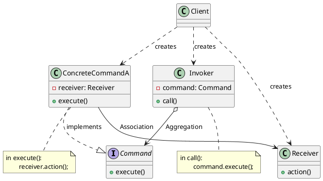

# 命令模式

最新更新：`= dateformat(date(today), "yyyy-MM-dd")`

---

## 核心内容

- 请求发送者直接调用接收者的方法，导致紧耦合
- 引入命令对象为中介，发送者只需要知道如何触发命令，无需了解接收者的细节。例如可以通过开关链接到各种电器

## 正文

- 将请求发送者与接收者完全解耦，发送者与接收者之间没有直接引用关系
- Command：抽象命令类，声明了用于执行请求execute()的接口，可以通过这些方法调用接收者的业务方法
- ConcreteCommand：
	- 具体命令类，实现了execute()，将调用接收者对象的相关操作(Action)
	- 持有接收者引用
- Invoker：
	- 调用者，通过命令类来执行请求
	- 持有抽象命令类的引用，调用execute，以间接调用接收者的业务方法
- Receiver：接收者，实现具体业务逻辑

## 模式优点

## 模式缺点

## 模式扩展

## 实际代码/示例
[[命令模式代码]]

## 相关链接
[[软件设计模式]]
[[行为型模式]]

