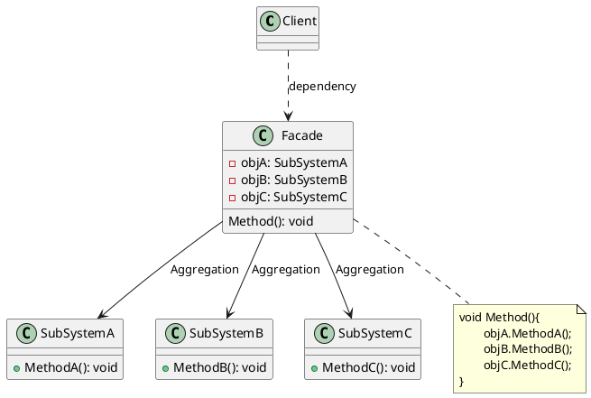

# 外观模式

最新更新：`= dateformat(date(today), "yyyy-MM-dd")`

---

## 核心内容

- 用于简化客户端与复杂子系统之间的交互
- 例如DIY装机，你需要知道具体的CPU，GPU还有合适的主板；但是你也可以找一个装机公司（外观角色）帮你直接配好
## 正文

- 引入一个统一的“外观”接口来封装子系统的细节，让客户端无需知道子系统的内部结构
- 是[[迪米特法则]]的具体实现
- Facade：
	- 外观角色，客户端直接与其交流。
	- 正常情况，它将客户端发来的请求委派到相应子系统中，传递给相应的子系统对象处理。
	- 不实现具体业务逻辑，协调子系统
- SubSystem：
	- 子系统角色，每一个子系统可以是一个单独的类，也可是多个类的集合。
	- 子系统不知道Facade的存在，将其视为一个普通的客户端

[[外观模式-2025-11-23-13-00-54.svg]]

## 模式优点

## 模式缺点

## 模式扩展

## 实际代码/示例

[[外观模式代码]]

## 相关链接
[[软件设计模式]]
[[结构型模式]]
[[外观模式与装饰模式的区别与联系]]

