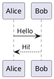

# 外观模式

最新更新：`= dateformat(date(today), "yyyy-MM-dd")`

---

## 核心内容

## 正文

```plantuml-svg
@startuml 
Alice -> Bob: Hello 
Bob --> Alice: Hi! 
@enduml
```

## 实际代码/示例

[[外观模式代码]]

## 相关链接
[[软件设计模式]]
[[结构型模式]]

