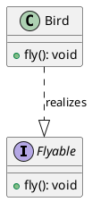

# 实现（Realization）关系

最新更新：`= dateformat(date(today), "yyyy-MM-dd")`

---

## 核心内容

实现是在设计模式中，表示一个类（或组件）实现另一个元素（通常是接口或抽象规范）的行为或契约。强调“提供实现”的关系，而不是继承通用特征

## 正文

- 接口定义“做什么”，类提供“怎么做”
- 在代码中通常用==implement==关键字（例如Java）
- 类必须实现(在Java中用Override)接口中所有抽象方法
- 在UML图中，从类 用虚线带空心箭头指向 更抽象的元素（如接口）


## 相关链接
[[软件设计模式]]
[[UML]]
[[泛化（Generalization）关系]]


## 实际代码/示例

```java
interface Flyable {  // 接口：定义契约
    void fly();  // 抽象方法
}

class Bird implements Flyable {  // 类：实现接口
    @Override
    public void fly() {
        System.out.println("Bird flying with wings");
    }
}
```


[[实现（Realization）关系-2025-11-20-06-53-18.svg]]



