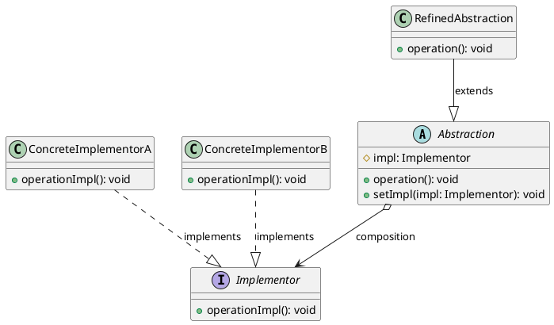

# 桥接模式

最新更新：`= dateformat(date(today), "yyyy-MM-dd")`

---

## 核心内容

- 大中小三种型号的蜡笔，有n种颜色，需要3n个蜡笔，这意味着型号与颜色有着较强的耦合
- 而同种情况的毛笔，只需要三支大中小的毛笔，与n种颜料就行，即n+3。毛笔将型号与颜色这两种维度进行解耦合
- 毛笔的设计大量减少了类的数量

## 正文

- 将抽象部分（通常是业务核心逻辑，比如画笔型号）与实现部分（辅助或可变的部分，比如画笔的颜色）分离
- 将独立变化的维度抽象出来，使它们独立扩展，使得系统更加符合[[单一职责原则]]
- Implementor对象可以独立创建、被多个Abstraction实例共享，所以两者的关系应该是聚合

[[桥接模式-2025-11-23-08-55-12.svg]]

## 模式优点

## 模式缺点

## 模式扩展
[[适配器模式与桥接模式]]

## 实际代码/示例
[[桥接模式代码]]

## 相关链接
[[软件设计模式]]
[[结构型模式]]

