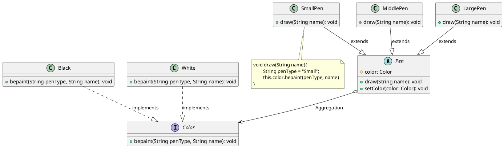

# 桥接模式代码

最新更新：`= dateformat(date(today), "yyyy-MM-dd")`

**语言**：Java

**一句话描述**:模拟毛笔（将型号与颜色两个维度独立出来）

```java
public class App {
	public static void main(String[] args) {
	}
}
```


[[桥接模式代码-2025-11-23-08-54-56.svg]]


## Reference
[[桥接模式]]