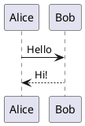

# 简单工厂模式

最新更新：`= dateformat(date(today), "yyyy-MM-dd")`

---

## 核心内容

## 正文

## 相关链接
[[软件设计模式]]
[[创建型模式]]

## 实际代码/示例

```plantuml-svg
@startuml 
Alice -> Bob: Hello 
Bob --> Alice: Hi! 
@enduml
```

