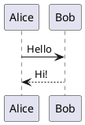

# 组合OR合成（Composition）关系

最新更新：`= dateformat(date(today), "yyyy-MM-dd")`

---

## 核心内容

组合表示

## 正文

## 相关链接
[[软件设计模式]]
[[UML]]
[[聚合OR聚集（Aggregation）关系]]
[[关联（Association）关系]]
[[聚合和组合与关联的关系]]

## 实际代码/示例

