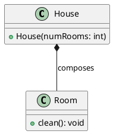

# 组合OR合成（Composition）关系

最新更新：`= dateformat(date(today), "yyyy-MM-dd")`

---

## 核心内容

组合表示整体（类A）与部分（类B）的关系，但部分对象没有独立的生命周期。类B完全属于类A，类A生命周期结束时，类B也随之消亡。==整体类负责部分类的生命周期==。

## 正文

- 类A在构造时创建类B的实例，并持有其引用。类B不能被外部独立创建或共享
- 通常用“contains-a”表示，部分完全从属于整体（房间不能脱离房子独立存在）
- 在UML图中，用实心菱形由整体类（类A）指向部分类（类B）


## 相关链接
[[软件设计模式]]
[[UML]]
[[聚合OR聚集（Aggregation）关系]]
[[关联（Association）关系]]
[[聚合和组合与关联的关系]]


## 实际代码/示例

```java
class Room {  // 类B：部分
    public void clean() {
        System.out.println("Room cleaned");
    }
}

class House {  // 类A：整体
    private List<Room> rooms;  // 组合：部分由整体创建和管理

    public House(int numRooms) {
        rooms = new ArrayList<>();
        for (int i = 0; i < numRooms; i++) {
            rooms.add(new Room());  // 内部创建，无法外部独立
        }
    }

    // 如果House销毁，rooms也会被垃圾回收（无外部引用）
}

// 使用示例
House myHouse = new House(3);  // 房间随房子创建
// 无法独立创建Room并添加到House；房间生命周期绑定于House
```


[[组合OR合成（Composition）关系-2025-11-20-06-20-26.svg]]



