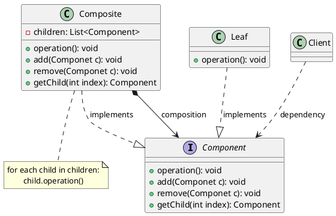

# 组合模式

最新更新：`= dateformat(date(today), "yyyy-MM-dd")`

---

## 核心内容

- 软件中存在很多树形结构（文件管理系统、公司组织系统），树形结构有容器对象与叶子对象
- 客户端在遍历使用树形结构的时候，由于容器与叶子对象在功能上有所不同，但是我们想要客户端一致处理这两者

## 正文

- 容器对象与叶子对象功能上有所不同，但在使用时需要有一致性
- 定义了一个抽象组件类，既可以代表叶子，也可以代表容器。客户端无需知道具体是哪个类，拿来直接用就行
- 由于是树形结构，容器与叶子之间还有聚合关联关系，以此实现递归组合，形成树形结构
- 在常见的组合模式样例中，Composite与Component的关系一般是组合（Composition），因为强调递归关系形成树形结构。如果用聚合，可能会导致Component被多个Composition共享，所以用关系更强的组合
[[组合模式-2025-11-23-09-45-20.svg]]

## 模式优点

## 模式缺点

## 模式扩展
[[透明组合模式]]
[[安全组合模式]]

## 实际代码/示例
[[组合模式代码]]

## 相关链接
[[软件设计模式]]
[[结构型模式]]

