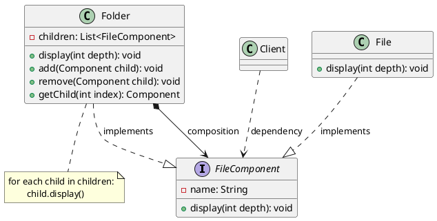

# 组合模式代码

最新更新：`= dateformat(date(today), "yyyy-MM-dd")`

**语言**：Java

**一句话描述**: 文件管理系统

```java
public class App {
	public static void main(String[] args) {
	}
}
```

[[组合模式代码-2025-11-23-11-33-49.svg]]


## References
[[组合模式]]