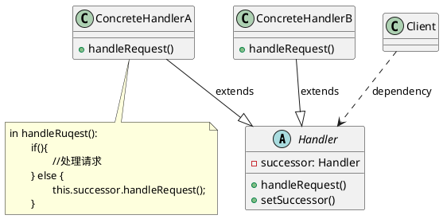

# 职责链模式

最新更新：`= dateformat(date(today), "yyyy-MM-dd")`

---

## 核心内容

- 请求发送者发送一个请求，但有许多的对象可能会处理这个请求，但是请求发送者并不知道
- 通过链式动态传递请求，实现请求发送者与接收者的解耦
- 符合[[开闭原则]]与[[合成复用原则]]

## 正文

- Handler：
	- 抽象处理者，定义一个处理请求的接口
	- 包含一个指向下一个处理者（#successor）的引用
- ConcreteHandler：
	- 具体处理者，实现抽象处理定义的接口
	- 在处理请求之前需要进行判断，如果有权限就处理请求，没有就交给后继者
- 职责链模式不负责创建职责链，一般是在调用职责链的客户端创建职责链
- 纯的职责链模式
	- 要么全部承担责任，要么将责任推给下家
- 不纯的职责链模式
	- 允许请求被部分处理后再向下传递
	- 或者处理完某个请求后，其后继者可以继续处理该请求

[[职责链模式-2025-11-24-01-52-27.svg]]

## 模式优点

## 模式缺点

## 模式扩展

## 实际代码/示例
[[职责链模式代码]]

## 相关链接
[[软件设计模式]]
[[行为型模式]]

