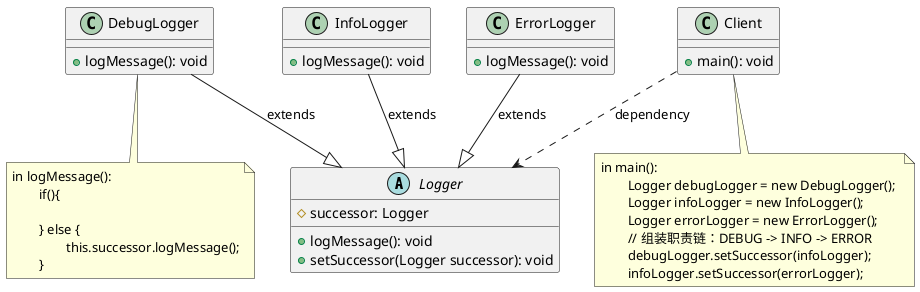

# 职责链模式代码

最新更新：`= dateformat(date(today), "yyyy-MM-dd")`

**语言**：Java

**一句话描述**：不同级别的日志由链上的不同处理器处理

```java
public class App {
	public static void main(String[] args) {
	}
}
```



## References
[[职责链模式]]