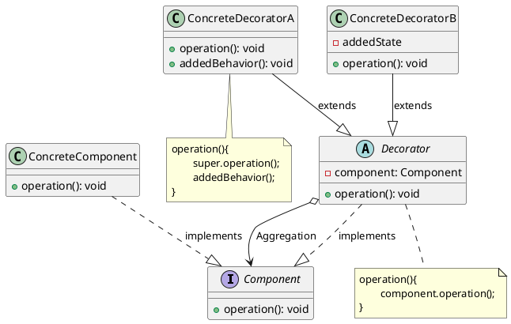

# 装饰模式

最新更新：`= dateformat(date(today), "yyyy-MM-dd")`

---

## 核心内容

- 两种方式给一个类或对象增加行为（新功能）
- 继承机制，这种方法是静态的，用户不能控制增加的行为的方式和时机
- 关联机制，保持可扩展性、透明性，而且更加灵活，符合[[合成复用原则]]

## 正文

- Component：抽象组件，是具体组件与抽象装饰类的共同父类，声明了具体组件中实现的业务方法；引入它的作用，可以让客户端以一致的方处理未被装饰的对象以及装饰之后的对象
- ConcreteComponent：具体组件，实现了抽象组件声明的业务方法，只提供最基本的功能，不包含扩展逻辑。例如变形金刚中，Car就是具体组件，实现最基本的move()方法
- Decorator：抽象装饰类，是抽象组件的子类，用于给具体组件扩展功能，但是扩展的具体功能在子类中实现，维护一个Component类型的引用（通常通过构造方法注入），提供一个接口供子类实现(component.opertaion())
- ConcreteDecorator：具体装饰类，负责扩展组件的功能，super父类的operation，再添加新行为\

[[装饰模式-2025-11-23-12-10-57.svg]]

## 模式优点

## 模式缺点

## 模式扩展

## 实际代码/示例
[[装饰模式代码]]

## 相关链接
[[软件设计模式]]
[[结构型模式]]

