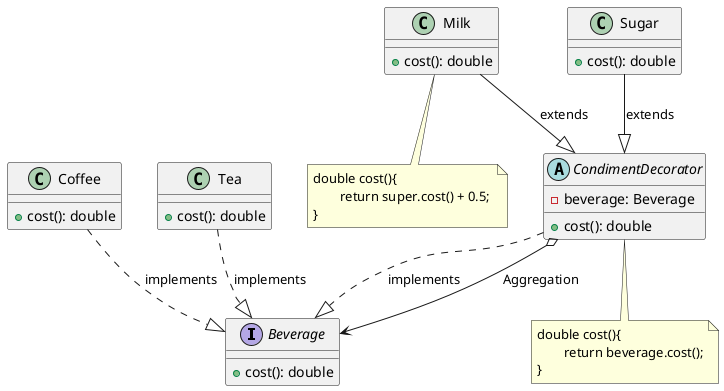

# 装饰模式代码

最新更新：`= dateformat(date(today), "yyyy-MM-dd")`

**语言**：Java

**一句话描述**：基本饮料（Tea，Coffee）可以动态添加小料

```java
public class App {
	public static void main(String[] args) {
	}
}
```


[[装饰模式代码-2025-11-23-12-34-12.svg]]


## References
[[装饰模式]]