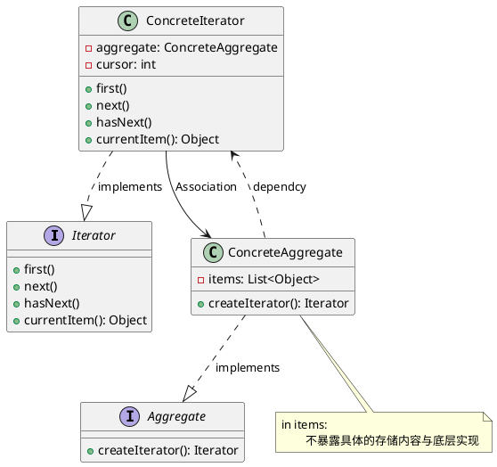

# 迭代器模式

最新更新：`= dateformat(date(today), "yyyy-MM-dd")`

---

## 核心内容

- [[聚合类]]有两个职责：1.存储数据，2.遍历数据；前者是聚合类的基本职责，而后者是可变化的，可分离的
- 因此我们把遍历数据的行为抽象出来，封装在迭代器对象中，由迭代器来负责遍历数据的行为
- 这简化了聚合类的设计，更符合[[单一职责原则]]

## 正文

- 提供一种方法来访问聚合对象，而不暴露对象的内部表示
- Aggregate：
	- 抽象聚合类，用于管理与存储元素对象
	- 声明一个createIterator()方法来创建迭代器对象，充当抽象工厂角色，让每个具体聚合类都能产生相应的迭代器对象
- ConcreteAggregate： 
	- 具体聚合类，实现抽象聚合类声明的createIterator()，并返回一个具体迭代器实例
- Iterator： 抽象迭代器，定义了访问与遍历元素的接口
- ConcreteIterator：具体迭代器，实现了抽象迭代器的接口，完成对聚合对象的遍历；同时使用游标来记录聚合对象所处的当前位置，游标一般为表示位置的非负整数

[[迭代器模式-2025-11-24-03-20-45.svg]]

## 模式优点

## 模式缺点

## 模式扩展
[[内部迭代器]]
[[外部迭代器]]

## 实际代码/示例
[[迭代器模式代码]]

## 相关链接
[[软件设计模式]]
[[行为型模式]]

