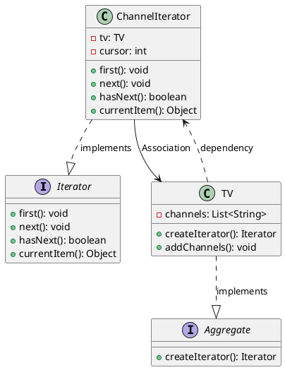

# 迭代器模式代码

最新更新：`= dateformat(date(today), "yyyy-MM-dd")`

**语言**：Java

**一句话描述**：

```java
public class App {
	public static void main(String[] args) {
	}
}
```

[[迭代器模式代码-2025-11-24-03-28-08.svg]]


## References
[[迭代器模式]]