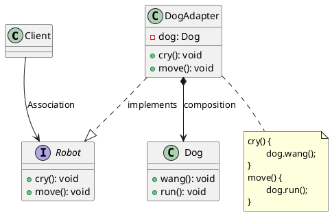

# 适配器模式代码

最新更新：`= dateformat(date(today), "yyyy-MM-dd")`

**语言**：Java

**一句话描述**：机器人实现动物行为

```java
public class App {
	public static void main(String[] args) {
	}
}
```

[[适配器模式代码-2025-11-23-08-54-32.svg]]


## Reference
[[适配器模式]]
