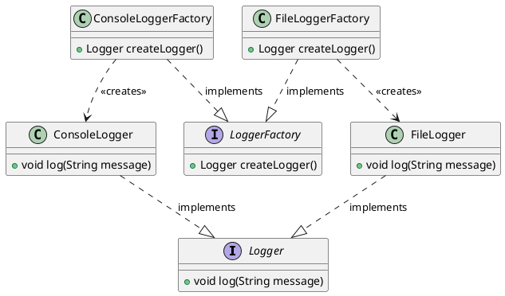

# 工厂方法模式代码

最新更新：`= dateformat(date(today), "yyyy-MM-dd")`

**语言**：Java

**一句话描述**: 具体产品的实例化通过相应的具体工厂类实现

```java
public class App {
	public static void main(String[] args) {
		LoggerFactory factory;
		Logger logger;
		factory = new ConsoleLoggerFactory();
		logger = factory.createLogger();
		logger.log("Hello, Console");
		
		factory = new FileLoggerFactory();
		logger = factory.createLogger();
		logger.log("Hello, File");
	}
}
```

```java
public interface Logger{
	public abstract void log(String message);
}
```

```java
public class ConsoleLogger implements Logger{
	@Override
	public void log(String message){
		System.out.println("[Console] " + message);
	}
}
```

```java
public interface LoggerFactory{
	public abstract Logger createLogger();
}
```

```java
public class ConsoleLoggerFactory implements LoggerFactory {
	@Override
	public Logger createLogger(){
		return new ConsoleLogger();
	}
}
```

```java
public class FileLogger implements Logger{
	@Override
	public void log(String message){
		System.out.println("[File] " + message);
	}
}
```

```java
public class FileLoggerFactory implements LoggerFactory {
	@Override
	public Logger createLogger(){
		return new FileLogger();
	}
}
```


[[工厂方法模式代码-2025-11-21-02-24-14.svg]]

