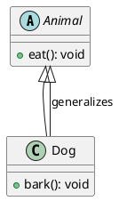

# 泛化（Generalization）关系

最新更新：`= dateformat(date(today), "yyyy-MM-dd")`

---

## 核心内容

泛化关系在面向对象设计中就是继承（Inheritance）关系

## 正文

- 表示一个类（子类或具体类）从另一个类（父类或抽象类）继承属性与行为。子类“is-a”父类，继承其通用特征，同时可以覆盖或添加特定特征
- 在UML图中，子类用 实线带空心箭头 指向父类

## 相关链接
[[软件设计模式]]
[[UML]]
[[实现（Realization）关系]]


## 实际代码/示例

```java
class Animal {  // 父类（泛化中的通用类）
    public void eat() {
        System.out.println("Eating");
    }
}

class Dog extends Animal {  // 子类（泛化中的具体类）
    public void bark() {
        System.out.println("Barking");
    }
}
```


[[泛化（Generalization）关系-2025-11-20-06-46-32.svg]]


