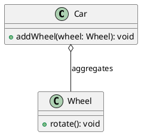

# 聚合OR聚集（Aggregation）关系

最新更新：`= dateformat(date(today), "yyyy-MM-dd")`

---

## 核心内容

聚合表示==整体==（类A）与==部分==（类B等）之间的关系，例如宿舍与学生、PC与CPU。但是部分对象（类B）==有自己的生命周期==，不会因为类A的销毁（生命周期结束）而自动销毁

## 正文

- 类A持有类B的引用作为成员变量，但类B的实例可以被其他对象共享或独立创建/销毁
- 通常用“has-a”的关系描述，但部分不完全属于整体，例如X汽车的轮子可以移动到Y汽车上
- 在UML图中，使用空心菱形（◇）表示整体端（类A），实线连接部分（类B）。


## 相关链接
[[软件设计模式]]
[[UML]]
[[组合OR合成（Composition）关系]]
[[关联（Association）关系]]
[[聚合和组合与关联的关系]]


## 实际代码/示例

```java
class Wheel {  // 类B：部分
    public void rotate() {
        System.out.println("Wheel rotating");
    }
}

class Car {  // 类A：整体
    private List<Wheel> wheels;  // 聚合：持有部分引用，但部分可独立

    public Car() {
        wheels = new ArrayList<>();
    }

    public void addWheel(Wheel wheel) {
        wheels.add(wheel);  // 可以添加外部创建的Wheel
    }
}

// 使用示例
Wheel spareWheel = new Wheel();  // 独立创建
Car myCar = new Car();
myCar.addWheel(spareWheel);  // 添加到整体
// 如果myCar销毁，spareWheel仍存在，可用于其他Car
```


[[聚合OR聚集（Aggregation）关系-2025-11-20-03-37-11.svg]]



