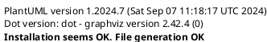

# <% tp.file.title %>

最新更新：`= dateformat(date(today), "yyyy-MM-dd")`

**语言**：Java

**一句话描述**：

```java
public class App {
	public static void main(String[] args) {
	}
}
```


```plantuml-svg
@startuml
testdot
@enduml
```

## References
