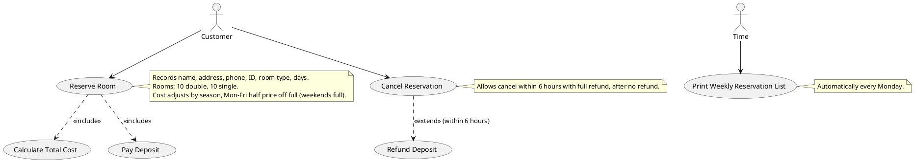
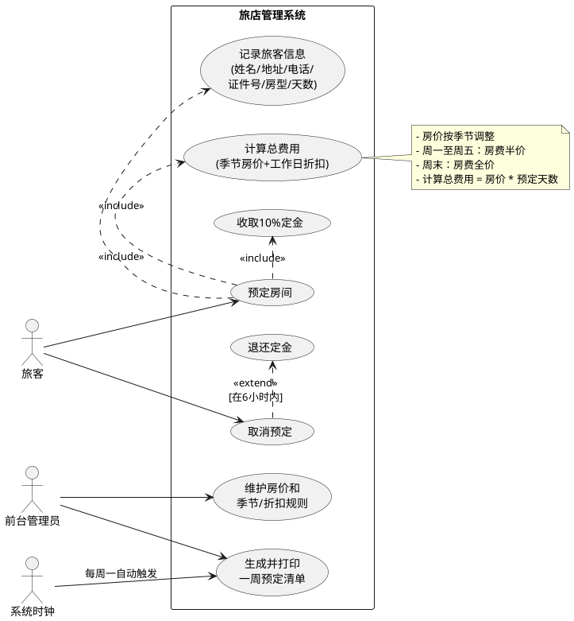
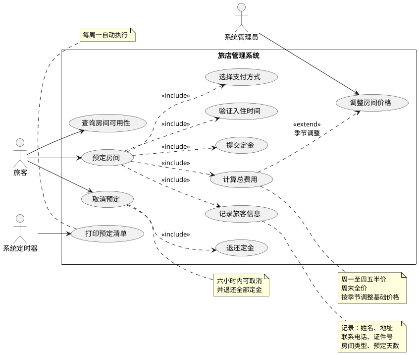

```plantuml-svg
@startuml
actor Customer
actor Time

usecase "Reserve Room" as UC1
usecase "Calculate Total Cost" as UC2
usecase "Pay Deposit" as UC3
usecase "Cancel Reservation" as UC4
usecase "Refund Deposit" as UC5
usecase "Print Weekly Reservation List" as UC6

Customer --> UC1
UC1 ..> UC2 : <<include>>
UC1 ..> UC3 : <<include>>
Customer --> UC4
UC4 ..> UC5 : <<extend>> (within 6 hours)
Time --> UC6

note right of UC1
Records name, address, phone, ID, room type, days.
Rooms: 10 double, 10 single.
Cost adjusts by season, Mon-Fri half price off full (weekends full).
end note

note right of UC4
Allows cancel within 6 hours with full refund, after no refund.
end note

note right of UC6
Automatically every Monday.
end note

@enduml
```

```plantuml-svg
@startuml
left to right direction
skinparam packageStyle rectangle

actor "旅客" as Customer
actor "前台管理员" as Clerk
actor "系统时钟" as Clock

rectangle "旅店管理系统" {

  usecase "预定房间" as UC_Reserve
  usecase "记录旅客信息\n(姓名/地址/电话/\n证件号/房型/天数)" as UC_Record
  usecase "计算总费用\n(季节房价+工作日折扣)" as UC_Fee
  usecase "收取10%定金" as UC_Deposit

  usecase "取消预定" as UC_Cancel
  usecase "退还定金" as UC_Refund

  usecase "维护房价和\n季节/折扣规则" as UC_Price
  usecase "生成并打印\n一周预定清单" as UC_Report
}

' —— 参与者与用例关系 ——
Customer --> UC_Reserve
Customer --> UC_Cancel

Clerk --> UC_Price
Clerk --> UC_Report

Clock --> UC_Report  : 每周一自动触发

' —— 用例之间的包含与扩展关系 ——
UC_Reserve .> UC_Record  : <<include>>
UC_Reserve .> UC_Fee     : <<include>>
UC_Reserve .> UC_Deposit : <<include>>

UC_Cancel .> UC_Refund   : <<extend>>\n[在6小时内]

' —— 备注：费用规则说明 ——
note right of UC_Fee
  - 房价按季节调整
  - 周一至周五：房费半价
  - 周末：房费全价
  - 计算总费用 = 房价 * 预定天数
end note

@enduml
```

```plantuml-svg
@startuml
left to right direction
skinparam packageStyle rectangle

actor "旅客" as Customer
actor "系统管理员" as Admin
actor "系统定时器" as Timer

rectangle "旅店管理系统" {
  usecase "预定房间" as UC1
  usecase "取消预定" as UC2
  usecase "查询房间可用性" as UC3
  usecase "记录旅客信息" as UC4
  usecase "计算总费用" as UC5
  usecase "提交定金" as UC6
  usecase "退还定金" as UC7
  usecase "调整房间价格" as UC8
  usecase "打印预定清单" as UC9
  usecase "验证入住时间" as UC10
  usecase "选择支付方式" as UC11
}

Customer --> UC1
Customer --> UC2
Customer --> UC3

UC1 ..> UC4 : <<include>>
UC1 ..> UC5 : <<include>>
UC1 ..> UC6 : <<include>>
UC1 ..> UC10 : <<include>>
UC1 ..> UC11 : <<include>>

UC2 ..> UC7 : <<include>>

UC5 ..> UC8 : <<extend>>\n季节调整

Admin --> UC8
Timer --> UC9

note right of UC2
  六小时内可取消
  并退还全部定金
end note

note right of UC5
  周一至周五半价
  周末全价
  按季节调整基础价格
end note

note right of UC4
  记录：姓名、地址
  联系电话、证件号
  房间类型、预定天数
end note

note bottom of UC9
  每周一自动执行
end note

@enduml
```